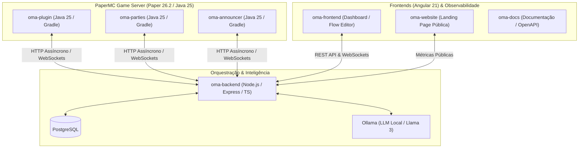

# 🧙‍♂️ Orquestrador de Masmorras Autônomo (O.M.A. Ecosystem)

> **Autonomous Dungeon Master & Procedural Engine for Minecraft**  
> Ecossistema distribuído que combina modelos de linguagem locais (LLM via Ollama), orquestração de microsserviços em Node.js/TypeScript, interfaces administrativas em Angular e renderização física de alta performance no PaperMC.

---

## 🏗️ Arquitetura do Ecossistema



---

## 📦 Módulos do Repositório

| Repositório                                                               | Stack Principal                 | Descrição                                                                                    |
| ------------------------------------------------------------------------- | ------------------------------- | -------------------------------------------------------------------------------------------- |
| [oma-infra](https://github.com/oma-ecosystem/oma-infra)                   | Docker Compose, Shell, Batch    | Orquestração central do ecossistema: compose, variáveis de ambiente e scripts de inicialização. |
| [oma-plugin](https://github.com/oma-ecosystem/oma-plugin)                 | Java 25, PaperMC, Gradle        | Geração paramétrica/erosão, escalonamento de party, testes de perícia d20 e itens soulbound. |
| [oma-parties](https://github.com/oma-ecosystem/oma-parties)               | Java 25, PaperMC, Gradle        | Sistema de grupos RPG, Roles (Tank/Healer/DPS), Party Finder, Waypoints e PartyHUD.          |
| [oma-announcer](https://github.com/oma-ecosystem/oma-announcer)           | Java 25, PaperMC, Gradle        | Sistema de broadcasts globais, anúncios interativos e enquetes integradas.                   |
| [oma-backend](https://github.com/oma-ecosystem/oma-backend)               | Node.js, TypeScript, PostgreSQL | API em Domain-Driven Design, validação estrita via Zod, WebSockets e bridge com IA local.    |
| [oma-frontend](https://github.com/oma-ecosystem/oma-frontend)             | Angular 21, SCSS, RxJS          | Painel administrativo com Canvas de nós interativo (Pan/Zoom), gestão de campanhas e BI.     |
| [oma-website](https://github.com/oma-ecosystem/oma-website)               | Angular 21, Responsive UI       | Landing page institucional exibindo status e métricas em tempo real direto do banco.         |
| [oma-player-portal](https://github.com/oma-ecosystem/oma-player-portal)   | Angular 21, Responsive UI       | Portal do jogador para consulta de personagens, missões ativas e histórico de partidas.      |
| [oma-bot](https://github.com/oma-ecosystem/oma-bot)                       | Node.js, Discord.js             | Bot de Discord integrado ao backend para notificações de eventos e comandos de campanha.     |
| [oma-docs](https://github.com/oma-ecosystem/oma-docs)                     | Docusaurus, Swagger OpenAPI     | Portal técnico detalhado de arquitetura, contratos de API e guias operacionais.              |

---

## ⚙️ Destaques Técnicos

* **Zero Cloud Cost:** Processamento de IA totalmente local via Ollama, eliminando custos de tokens de terceiros.
* **Resiliência Estrutural:** Validação estrita de contratos JSON e prevenção de loops cíclicos em grafos de nós.
* **Geração Matemática:** Criação procedural de estruturas sem uso de schematics estáticos, aplicando `Math.cos/sin` e algoritmos de erosão.
* **Infraestrutura Automatizada:** Suporte completo a Docker Compose, scripts de CI local e esteiras de testes unitários (Jest, JUnit, Jasmine).

---

## 🚀 Como Executar o Ecossistema

```bash
# Clone os repositórios do ecossistema no mesmo diretório pai
git clone https://github.com/oma-ecosystem/oma-infra.git
git clone https://github.com/oma-ecosystem/oma-backend.git
git clone https://github.com/oma-ecosystem/oma-frontend.git
git clone https://github.com/oma-ecosystem/oma-website.git
git clone https://github.com/oma-ecosystem/oma-player-portal.git

# Configure as variáveis de ambiente
cd oma-infra
cp .env.example .env

# Suba toda a infraestrutura a partir do oma-infra
docker compose up -d --build

# Ou use o script de atalho:
# Windows → .\scripts\start.bat
# Linux/macOS → ./scripts/start.sh
```
