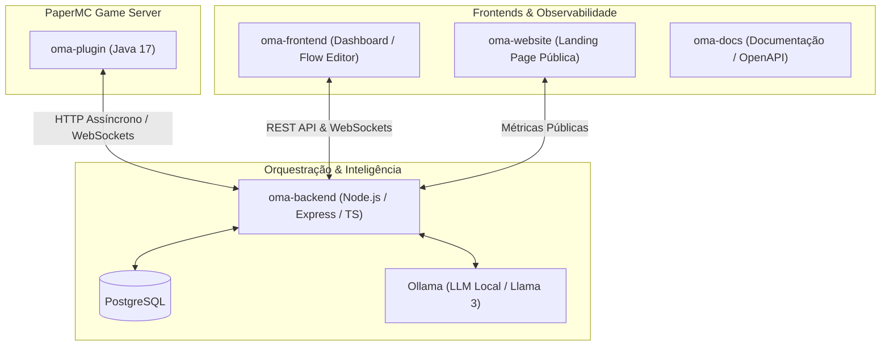

# 🧙‍♂️ Orquestrador de Masmorras Autônomo (O.M.A. Ecosystem)

> **Autonomous Dungeon Master & Procedural Engine for Minecraft**  
> Ecossistema distribuído que combina modelos de linguagem locais (LLM via Ollama), orquestração de microsserviços em Node.js/TypeScript, interfaces administrativas em Angular e renderização física de alta performance no PaperMC.

---

## 🏗️ Arquitetura do Ecossistema



---

## 📦 Módulos do Repositório

| Repositório                                                   | Stack Principal                 | Descrição                                                                                    |
| ------------------------------------------------------------- | ------------------------------- | -------------------------------------------------------------------------------------------- |
| [oma-plugin](https://github.com/oma-ecosystem/oma-plugin)     | Java 17, PaperMC, Maven         | Geração paramétrica/erosão, escalonamento de party, testes de perícia d20 e itens soulbound. |
| [oma-backend](https://github.com/oma-ecosystem/oma-backend)   | Node.js, TypeScript, PostgreSQL | API em Domain-Driven Design, validação estrita via Zod, WebSockets e bridge com IA local.    |
| [oma-frontend](https://github.com/oma-ecosystem/oma-frontend) | Angular, SCSS, RxJS             | Painel administrativo com Canvas de nós interativo (Pan/Zoom), gestão de campanhas e BI.     |
| [oma-website](https://github.com/oma-ecosystem/oma-website)   | Angular, Responsive UI          | Landing page institucional exibindo status e métricas em tempo real direto do banco.         |
| [oma-docs](https://github.com/oma-ecosystem/oma-docs)         | Docusaurus, Swagger OpenAPI     | Portal técnico detalhado de arquitetura, contratos de API e guias operacionais.              |

---

## ⚙️ Destaques Técnicos

* **Zero Cloud Cost:** Processamento de IA totalmente local via Ollama, eliminando custos de tokens de terceiros.
* **Resiliência Estrutural:** Validação estrita de contratos JSON e prevenção de loops cíclicos em grafos de nós.
* **Geração Matemática:** Criação procedural de estruturas sem uso de schematics estáticos, aplicando `Math.cos/sin` e algoritmos de erosão.
* **Infraestrutura Automatizada:** Suporte completo a Docker Compose, scripts de CI local e esteiras de testes unitários (Jest, JUnit, Jasmine).

---

## 🚀 Como Executar o Ecossistema

```bash
# Clone o workspace completo ou use o docker-compose raiz
git clone https://github.com/oma-ecosystem/oma-backend.git
git clone https://github.com/oma-ecosystem/oma-frontend.git
git clone https://github.com/oma-ecosystem/oma-website.git

# Suba a infraestrutura conteinerizada
docker compose up -d --build
```
