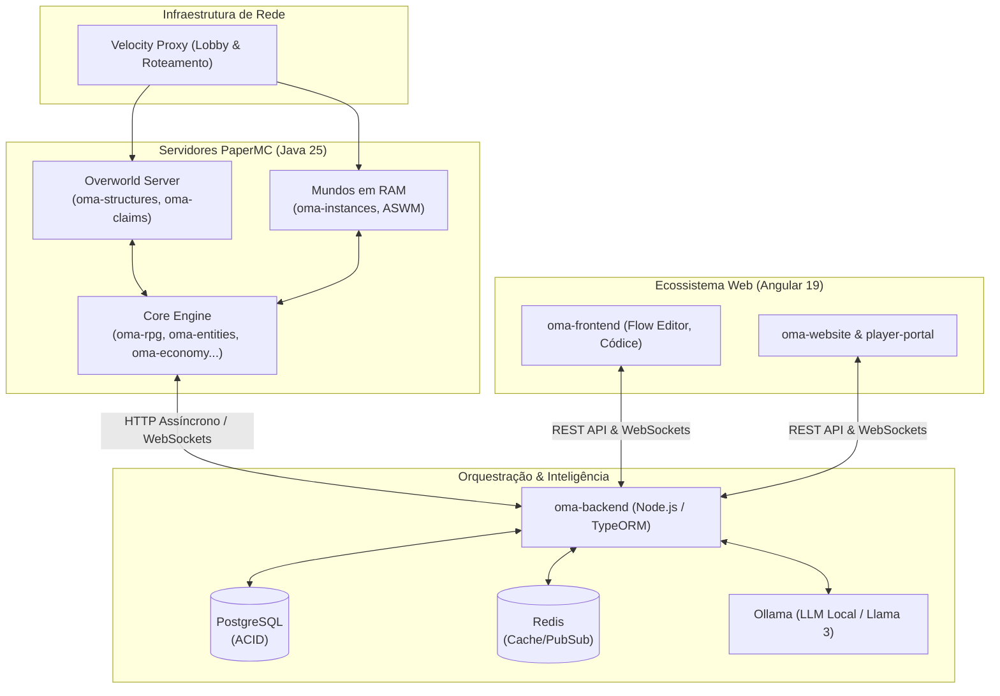

# 🧙♂️ Orquestrador de Masmorras Autônomo (O.M.A. Ecosystem)

> **Autonomous Dungeon Master & Procedural Engine for Minecraft**  
> Ecossistema distribuído de grau de produção que combina Modelos de Linguagem Locais (LLM via Ollama), orquestração de microsserviços em Node.js/TypeORM, interfaces administrativas em Angular 19 (Zoneless) e renderização física de instâncias em RAM no PaperMC/Velocity.

---

## 🏗️ Arquitetura do Ecossistema

O OMA não é apenas um plugin, é uma rede de microsserviços e módulos Java interconectados, desenhada com princípios de **Domain-Driven Design (DDD)**, transações **ACID** para economia e **Separação de Responsabilidades (SRP)**.



---

## 📦 Repositórios e Módulos

Nossos repositórios são divididos por pilares de responsabilidade, garantindo que o desenvolvimento e a manutenção sejam escaláveis.

### 🌐 Infraestrutura & Core
| Repositório | Stack | Descrição |
| :--- | :--- | :--- |
| **`oma-infra`** | Docker, Shell | Orquestração central: `docker-compose`, variáveis de ambiente e deploy de banco/redis. |
| **`oma-backend`** | Node.js, TypeORM | API central. Valida transações financeiras, pareia websockets e faz a ponte estruturada com a IA. |
| **`oma-proxy`** | Velocity | Gestor de tráfego de rede para transitar jogadores entre o mundo aberto e as instâncias fluidamente. |

### ⚔️ Motor do RPG (Core Gameplay)
| Repositório | Stack | Descrição |
| :--- | :--- | :--- |
| **`oma-instances`** | Java, ASWM | Motor de instanciamento. Carrega mapas `.slime` na memória RAM sob demanda e os destrói pós-uso. |
| **`oma-rpg`** | Java, Paper API | Cálculo de atributos (Status), motor de loot via NBT Tags e renderização matemática de feitiços (Partículas). |
| **`oma-entities`** | Java, Pathfinders | Substitui a IA Vanilla do Minecraft por comportamentos lógicos de combate tático (Bestiário Customizado). |
| **`oma-structures`** | Java, FAWE | Populador assíncrono de Chunks. Injeta construções predefinidas no mundo aberto sem lag de CPU. |
| **`oma-quests`** | Java, Llama 3 | Motor de missões com "Sincronia Inteligente" e "Modo Mercenário", gerando jornadas únicas com LLM. |
| **`oma-npcs`** | Java, TextDisplays | Interface narrativa in-game. Menus de diálogo visuais sincronizados em tempo real com o Códice. |

### 🤝 Economia & Sistemas Sociais
| Repositório | Stack | Descrição |
| :--- | :--- | :--- |
| **`oma-economy`** | Java, Vault | Banco Central do jogo. Sistema blindado contra duplicação de saldo usando locks pessimistas do PostgreSQL. |
| **`oma-marketplace`** | Java, Base64 | Casa de leilões cruzada (Web/Game) com taxa de queima (Gold Sink) e sistema de Caixa de Correio virtual. |
| **`oma-parties`** | Java, Redis | Gestão de grupos, sincronia de missões e HUDs. |
| **`oma-guilds`** | Java | Sistema político, campanhas coletivas e tesouraria. |
| **`oma-claims`** | Java | Proteção paramétrica de territórios amarrada às guildas. |
| **`oma-bounties`** | Java | PvP orientado a recompensas com sistema Escrow (dinheiro retido no backend). |

### 💻 Aplicações Web & Observabilidade
| Repositório | Stack | Descrição |
| :--- | :--- | :--- |
| **`oma-frontend`** | Angular 19 Zoneless | Painel administrativo (DM Tools) com Canvas de Nós, editor de Bestiário, Códice e métricas gráficas. |
| **`oma-telemetry`** | Java / WebSockets | Observabilidade em tempo real (TPS, RAM, Entidades) streamada direto para o dashboard do frontend. |
| **`oma-discord-link`**| Node.js / Java | Autenticação via OAuth, sincronia de cargos do LuckPerms e chat bidirecional em tempo real. |

---

## ⚙️ Destaques Técnicos da Arquitetura

* **Economia ACID (Anti-Dupe):** A arquitetura cruza o inventário do Minecraft com transações rígidas no banco de dados, prevenindo qualquer duplicação de itens ou moedas em casos de queda de servidor.
* **Cérebro Instanciado (RAM vs Disco):** Divisão arquitetural severa: a IA de monstros (`oma-entities`) roda na CPU, enquanto a geração de mapas (`oma-structures`) usa fluxos assíncronos de Disco, e as masmorras rodam unicamente na memória RAM volátil.
* **Integração LLM Paramétrica:** A Inteligência Artificial local (Ollama) não apenas gera textos, mas cospe regras em JSON calculando vetores matemáticos para desenhar magias (partículas) in-game.
* **Narrativa Híbrida (Modo Mercenário):** Resolução do "Dilema de Skyrim no Multijogador", sincronizando o progresso de missões de uma Party no banco de dados e congelando histórias individuais conflitantes.

---

## 🚀 Inicialização Rápida do Ecossistema

Para provisionar o ambiente local de desenvolvimento, utilize nossa esteira automatizada:

```bash
# 1. Clone a orquestração central
git clone https://github.com/oma-ecosystem/oma-infra.git
cd oma-infra

# 2. Copie os contratos de ambiente
cp .env.example .env

# 3. Suba o ecossistema (PostgreSQL, Redis, Backend, Ollama, Frontends)
docker compose up -d --build
```
