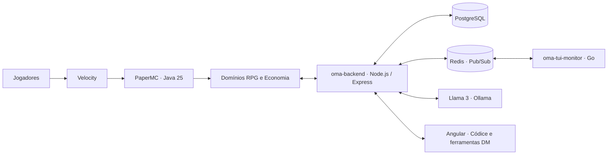

<h1>⚔️ O.M.A. — Orquestrador de Masmorras Automatizado</h1>

### Um ecossistema MMORPG para Minecraft, inspirado em Manhwa e Solo Leveling.

**Mundos vivos. Progressão própria. Histórias que reagem às escolhas dos jogadores.**

---

## 🌌 A Visão

O O.M.A. transforma Minecraft em uma jornada de RPG persistente: a progressão de atributos e habilidades é desacoplada do XP vanilla, enquanto masmorras procedurais escalam dos Tiers **F a S** e podem existir como instâncias isoladas em memória. No centro da aventura está uma narrativa impulsionada por IA local — **Llama 3 via Ollama** — conectada ao **Códice**, onde missões, escolhas e contexto do mundo podem evoluir junto com cada grupo. O resultado é uma plataforma modular para construir experiências de MMORPG emergentes, não apenas uma coleção de plugins.

## 🧭 Arquitetura e Tech Stack

Tecnologias organizadas por camada. Cada serviço usa somente o subconjunto de que precisa.

### 🏗️ Infra & Dados

### 🔌 Backend & API

### 🖥️ Frontend & TUI

### 🎮 Game Server

> **Precisão da stack:** o `oma-backend` atual usa Node.js, Express, TypeORM, PostgreSQL e Redis. NestJS e SQLite aparecem como opções do ecossistema, não como dependências obrigatórias dos serviços atuais.

```mermaid
flowchart LR
    Players[Jogadores] --> Proxy[Velocity]
    Proxy --> Paper[PaperMC · Java 25]
    Paper --> RPG[Domínios RPG e Economia]
    RPG <--> API[oma-backend · Node.js / Express]
    API <--> PG[(PostgreSQL)]
    API <--> Redis[(Redis · Pub/Sub)]
    API <--> AI[Llama 3 · Ollama]
    API <--> Web[Angular · Códice e ferramentas DM]
    Redis <--> TUI[oma-tui-monitor · Go]
```

## 🗺️ Mapa do Ecossistema

Explore os módulos por domínio. Cada nome leva ao repositório correspondente na organização.

<strong>🧱 Domínio Core & Infraestrutura</strong>

| Repositório | Papel |
|---|---|
| [oma-core](https://github.com/OMA-Ecosystem/oma-core) | APIs e utilitários compartilhados pelos plugins Java. |
| [oma-plugin](https://github.com/OMA-Ecosystem/oma-plugin) | Integrações e funcionalidades centrais do servidor Minecraft. |
| [oma-infra](https://github.com/OMA-Ecosystem/oma-infra) | Orquestração local de serviços e dependências com Docker Compose. |
| [oma-server](https://github.com/OMA-Ecosystem/oma-server) | Ambiente e operação do servidor Paper. |
| [oma-proxy](https://github.com/OMA-Ecosystem/oma-proxy) | Proxy Velocity e roteamento de jogadores. |
| [oma-backup](https://github.com/OMA-Ecosystem/oma-backup) | Backups agendados de mundos e arquivos do servidor. |
| [oma-maintenance](https://github.com/OMA-Ecosystem/oma-maintenance) | Soft-shutdown e janela segura de manutenção. |
| [oma-diagnostics](https://github.com/OMA-Ecosystem/oma-diagnostics) | Saúde do servidor, TPS, heap e resposta a condições críticas. |
| [oma-telemetry](https://github.com/OMA-Ecosystem/oma-telemetry) | Coleta e publicação de métricas operacionais. |
| [oma-tui-monitor](https://github.com/OMA-Ecosystem/oma-tui-monitor) | Monitor terminal dos eventos Redis do ecossistema. |

<strong>💰 Domínio de Economia & Comunidade</strong>

| Repositório | Papel |
|---|---|
| [oma-economy](https://github.com/OMA-Ecosystem/oma-economy) | Saldos, transações e economia do jogo. |
| [oma-marketplace](https://github.com/OMA-Ecosystem/oma-marketplace) | Leilões e caixa de correio entre jogadores. |
| [oma-bounties](https://github.com/OMA-Ecosystem/oma-bounties) | Recompensas e contratos entre jogadores. |
| [oma-guilds](https://github.com/OMA-Ecosystem/oma-guilds) | Guildas, territórios e sistemas coletivos. |
| [oma-parties](https://github.com/OMA-Ecosystem/oma-parties) | Grupos, coordenação e atividades cooperativas. |
| [oma-claims](https://github.com/OMA-Ecosystem/oma-claims) | Proteção de territórios e reivindicações. |
| [oma-leaderboards](https://github.com/OMA-Ecosystem/oma-leaderboards) | Rankings e placares de progresso. |

<strong>⚔️ Domínio de RPG & Instâncias</strong>

| Repositório | Papel |
|---|---|
| [oma-rpg](https://github.com/OMA-Ecosystem/oma-rpg) | Atributos, habilidades e combate RPG. |
| [oma-quests](https://github.com/OMA-Ecosystem/oma-quests) | Missões e narrativa assistida por IA. |
| [oma-instances](https://github.com/OMA-Ecosystem/oma-instances) | Mundos de masmorra instanciados sob demanda. |
| [oma-structures](https://github.com/OMA-Ecosystem/oma-structures) | Estruturas e conteúdo procedural do mundo. |
| [oma-entities](https://github.com/OMA-Ecosystem/oma-entities) | Criaturas e comportamentos de combate customizados. |
| [oma-npcs](https://github.com/OMA-Ecosystem/oma-npcs) | NPCs, diálogos e pontos de interação. |
| [oma-assets](https://github.com/OMA-Ecosystem/oma-assets) | Resource Pack e áudio contextual do jogo. |
| [oma-announcer](https://github.com/OMA-Ecosystem/oma-announcer) | Anúncios, boas-vindas e comunicação in-game. |

<strong>🌐 Aplicações Web, Integrações & Documentação</strong>

| Repositório | Papel |
|---|---|
| [oma-backend](https://github.com/OMA-Ecosystem/oma-backend) | API, persistência e integração com serviços do OMA. |
| [oma-frontend](https://github.com/OMA-Ecosystem/oma-frontend) | Ferramentas administrativas e Códice em Angular. |
| [oma-player-portal](https://github.com/OMA-Ecosystem/oma-player-portal) | Experiência web voltada a jogadores. |
| [oma-website](https://github.com/OMA-Ecosystem/oma-website) | Site público do projeto. |
| [oma-discord-link](https://github.com/OMA-Ecosystem/oma-discord-link) | Integração de contas, cargos e chat com Discord. |
| [oma-bot](https://github.com/OMA-Ecosystem/oma-bot) | Bot e automações da comunidade Discord. |
| [oma-docs](https://github.com/OMA-Ecosystem/oma-docs) | Documentação técnica e referências da plataforma. |

## 🤝 Contribua

O O.M.A. é construído em módulos para que cada domínio possa evoluir com contratos claros e colaboração aberta. Comece explorando o repositório mais próximo da sua área, leia o README local e abra uma issue para discutir mudanças maiores antes de enviar um pull request.

- **Desenvolvimento de plugins:** Java 25, PaperMC 26.2 e Gradle.
- **Serviços e APIs:** Node.js, TypeScript, Express, PostgreSQL e Redis.
- **Interfaces e ferramentas:** Angular e Go.
- **Narrativa e conteúdo:** missões, Códice, NPCs, criaturas e masmorras.

> A licença e as diretrizes de contribuição devem ser consultadas em cada repositório; não há uma licença única declarada para toda a organização neste workspace.
